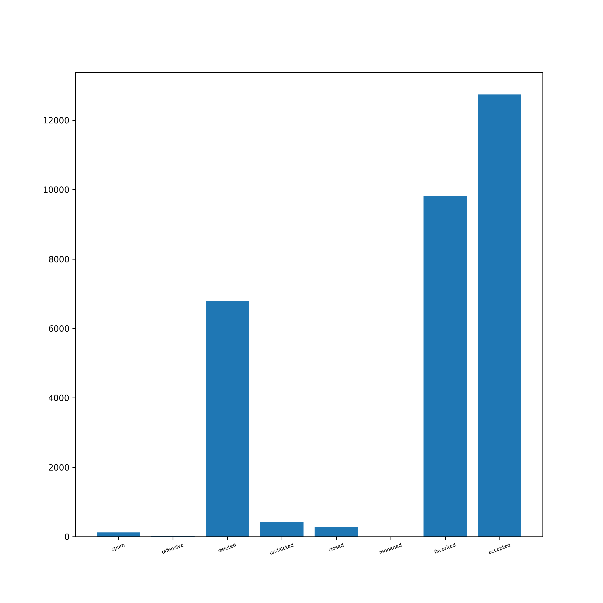

# crypto.stackexchange.com

# Overall Insights

<div align="center">

| Metric                             | Value |
|:-----------------------------------|------:|
| Total Posts                        | 25264 |
| Total Answers                      | 31692 |
| Number of Users                    | 71647 |
| Number of Comments                 | 35679 |
| Number of Votes                    | 289024|
| Number of Badges Awarded           | 107222|
| Number of Tags                     | 490   |
| <hr/>                              | <hr/> |
| Total Reputation Points            |5564726|
| Average Reputation per User        | 77.67 |
| <hr/>                              | <hr/> |
| Average Comment Score              | 0.52  |
| Average Comments per Post          | 3.33  |
| Average Comments per User          | 10.97 |
| Average Favorites per User         | 3.65  |
| Average Favorites per Post         | 2.43  |
| Average Upvote per Post            | 3.55  |
| Average Downvote per Post          | 0.34  |
| <hr/>                              | <hr/> |
| Total Closed Posts                 | 1985  |
| Total Open Posts                   | 23279 |
| Number of Posts with Related posts | 8119  |
| Average number of Related posts    | 1.41  |
| Number of Posts with Duplicates    | 1440  |
| Number of Duplicate Posts          | 1527  |

</div>
<br/>

# Posts

## Most Viewed Questions


<!-- <div><br/><br/><br/><br/></div> -->

## Most Answered Questions


<!-- <div><br/><br/><br/><br/></div> -->

## Most Commented Questions


<!-- <div><br/><br/><br/><br/></div> -->

## Highest Scored Questions


<!-- <div><br/><br/></div> -->

## Users With Most Questions Asked


<!-- <div><br/></div> -->

## Users with Most Answers Written


## Graphs

Post Graph: View it [here]()

User Graph: View it [here]()


# PostLinks

## Posts with Most Related Posts


<!-- <div><br/><br/><br/><br/></div> -->

## Posts with Most Duplicates


## Post Relation Graph

Please view it [here]()

<!-- <br/> -->

# PostHistory

<div align="center">

| Event                                  |Number |
|----------------------------------------|------:|
| Edit Body                              | 63724 |
| Edit Title                             | 7155  |
| Edit Tags                              | 6864  |
| Post Closed                            | 2362  |
| Post Reopened                          | 377   |
| Rollback Tags                          | 57    |
| Community Owned                        | 123   |
| Post Tweeted                           | 10108 |
| Post Migrated from Other SEs           | 1208  |
| Post Merge Destination                 | 162   |
| Rollback Body                          | 263   |
| Post Merge Source                      | 50    |
| Post Locked                            | 160   |
| Post Deleted                           | 440   |
| Post Undeleted                         | 441   |
| Post Protected                         | 122   |
| Post Unprotected                       | 9     |
| Post Migrated to Other SEs             | 22    |
| Post Unlocked                          | 48    |
| Rollback Title                         | 75    |
| Marked as Highly Active                | 773   |
| Unmarked as Highly Active              | 32    |

</div>
<!-- <br/> -->


<!-- <div><br/><br/><br/><br/></div> -->

## Post Close Reason

<div align="center">

| Reason                                 |Number |
|----------------------------------------|------:|
| Duplicate                              | 966   |
| Not a question                         | 14    |
| Opinion-based                          | 82    |
| Localized                              | 3     |
| Subjective                             | 3     |
| Pointless                              | 0     |
| Unclear                                | 301   |
| General Reference                      | 0     |
| Off-topic                              | 784   |
| Too broad                              | 209   |

</div>


<!-- <br/> -->

## Average Edits per Post

<div align="center">

| Type   | Value |
|--------|------:|
| Title  | 1.18  |
| Body   | 2.23  |
| Tags   | 1.19  |

</div>

## Average Rollbacks per Post

<div align="center">

| Type   | Value |
|--------|------:|
| Title  | 1.21  |
| Body   | 1.17  |
| Tags   | 1.19  |

</div>
<!-- <br/> -->

# Tags

## Tags Word Cloud

<div align="center">


</div>

<!-- <br/> -->

## Most Used Tags


<!-- <br/> -->

# Votes

## Total Votes

<div align="center">


| Category      | Votes     |
|---------------|----------:|
| Total         | 289024    |
| Accepted      | 12742     |
| Upvote        | 222717    |
| Downvote      | 21113     |
| Offensive     | 11        |
| Favorite      | 23848     |
| Close         | 530       |
| Reopen        | 0         |
| Bounty Start  | 357       |
| Bounty Close  | 352       |
| Delete        | 6799      |
| Undelete      | 433       |
| Spam          | 122       |

</div>
<!-- <br/> -->

## Special Types of Posts

<div align="center">



| Category     | Votes  |
|--------------|-------:|
| Spam         | 122    |
| Offensive    | 11     |
| Deleted      | 6798   |
| Undeleted    | 429    |
| Closed       | 286    |
| Reopened     | 0      |
| Favorited    | 9813   |
| Accepted     | 12742  |

</div>

## Bounties

<div align="center">

| Category       | Value |
|----------------|------:|
| Opened         | 567   |
| Closed         | 352   |
| Average Bounty | 93.52 |

</div>
<!-- <br/> -->

## Most Voted Questions

<div align="center">


</div>

<!-- <br/> -->

## Most Upvoted Questions

<div align="center">


</div>

<!-- <br/> -->

## Most Downvoted Questions

<div align="center">


</div>

<!-- <br/> -->

##  Most Favorited Questions

<div align="center">


</div>

<!-- <br/> -->

# Comments

## Comments by Year

<div align="center">


</div>

<!-- <br/> -->

## Comments by Month

<div align="center">


</div>

<!-- <br/> -->

## Most Commented Posts

<div align="center">


</div>

<!-- <br/> -->

## Users with Most Comments

<div align="center">


</div>

<!-- <br/> -->

# Users

## Most Reputed Users

<div align="center">


</div>

## Data Extracted from User Profiles __(profiles.results.json)__

| Location | Name | Personal Website | Media Handles | Photo |
|--|--|--|--|--|

Example:

```
"11975": {
    "name": "Marc Gravell", 
    "site": "http://blog.marcgravell.com”, 
    "location": "Forest of Dean, United Kingdom",  
    "photo": "https://i.stack.imgur.com/CrVFH.png", 
    "links": [
        http://blog.stackoverflow.com/2010/06/,
        welcome-stack-overflow-valued-associates-00006-and-00007/, mailto:marc.gravell@gmail.com,  mailto:marc@stackoverflow.com, http://blog.marcgravell.com/, http://marcgravell.com/, http://twitter.com/marcgravell, http://careers.stackoverflow.com/marcgravell, https://github.com/StackExchange/dapper-dot-net, https://github.com/StackExchange/StackExchange.Redis, http://code.google.com/p/protobuf-net/
    ]
}
```
<!-- <br/> -->

# Badges

## Total Badges Awarded:

<div align="center">

| Category | Badges |
|----------|-------:|
| Total    | 107222 |
| Gold     | 901    |
| Silver   | 10594  |
| Bronze   | 95349  |

</div>

## Badge Word Clouds

### Gold Badges

<div align="center">


</div>
<!-- <br/> -->

### Silver Badges

<div align="center">


</div>

### Bronze Badges


<!-- <br/> -->

## Top 10 Badges

<div align="center">

| Rank | Gold            | Silver        | Bronze           |
|------|-----------------|---------------|------------------|
| 1    | Famous Question | Yearling      | Autobiographer   |
| 2    | Fanatic         | Notable       | Supporter        |
| 3    | Electorate      | Question      | Student          |
| 4    | Great Answer    | Enlightened   | Editor           |
| 5    | Steward         | Constituent   | Scholar          |
| 6    | Great Question  | Good Answer   | Popular Question |
| 7    | Publicist       | Necromancer   | Informed         |
| 8    | Populist        | Enthusiast    | Teacher          |
| 9    | Copy Editor     | Good Question | Nice Answer      |
| 10   | Sheriff         | Guru          | Nice Question    |

</div>

## Badges Awarded Only Once

```
Socratic
Lifeboat
```

# Active Users Over Time

Net new users joining every month

<div align="center">


</div>

# Best Time to Ask a Question

Time of the day affecting questions and responses from the community:

<div align="center">

Hours in GMT


</div>
<!-- <br/> -->

# Voting vs. Reputation

Bar Graph of UpVote Rate vs Buckets of Reputation

<div align="center">


</div>
<!-- <br/> -->

# MapReduce

### AboutMe of Users

<div align="center">


</div>
<!-- <br/> -->

### Title of Posts

<div align="center">


</div>
<!-- <br/> -->

### Body of Posts

<div align="center">


</div>
<!-- <br/> -->

# Association Rule Mining

## Tags

### Frequent Itemsets

Shows last 10 itemsets. Entire list can be found at [ARM_tags_fits.csv](crypto.stackexchange.com/ARM_tags_fits.csv)

<div align="center">

|id|items|support|count|
|---|-------|---------|-------:|
|289|{twofish,number-field-sieve}|0.0015|88|
|290|{twofish,terminology}|0.0018|104|
|291|{visual-cryptography,number-field-sieve}|0.0093|538|
|292|{timestamping,visual-cryptography}|0.0012|70|
|293|{terminology,visual-cryptography}|0.008|465|
|294|{encryption,number-field-sieve}|0.0016|91|
|295|{terminology,number-field-sieve}|0.0069|399|
|296|{encryption,terminology}|0.0092|535|
|297|{terminology,timestamping}|0.0043|251|
|298|{terminology,visual-cryptography,number-field-sieve}|0.0026|149|

</div>

### Association Rules

Shows last 10 rules. Entire list can be found at [ARM_tags_mined.csv](crypto.stackexchange.com/ARM_tags_mined.csv)

|id|LHS|RHS|support|confidence|coverage|lift|count|
|--|---|---|-------|----------|--------|----|----:|
|257|{encryption}|{number-field-sieve}|0.0016|0.0403|0.0389|0.9905|91|
|258|{number-field-sieve}|{terminology}|0.0069|0.1691|0.0407|2.4348|399|
|259|{terminology}|{number-field-sieve}|0.0069|0.099|0.0695|2.4348|399|
|260|{encryption}|{terminology}|0.0092|0.2367|0.0389|3.4078|535|
|261|{terminology}|{encryption}|0.0092|0.1327|0.0695|3.4078|535|
|262|{timestamping}|{terminology}|0.0043|0.0988|0.0438|1.422|251|
|263|{terminology}|{timestamping}|0.0043|0.0623|0.0695|1.422|251|
|264|{visual-cryptography,number-field-sieve}|{terminology}|0.0026|0.277|0.0093|3.9868|149|
|265|{terminology,visual-cryptography}|{number-field-sieve}|0.0026|0.3204|0.008|7.8821|149|
|266|{terminology,number-field-sieve}|{visual-cryptography}|0.0026|0.3734|0.0069|11.3811|149|

<!-- <br/> -->

## Badges

### Frequent Itemsets

<div align="center">

Shows last 10 itemsets. Entire list can be found at [ARM_badges_fits.csv](crypto.stackexchange.com/ARM_badges_fits.csv)

|id|items|support|count|
|---|-------|---------|-------:|
|19|{Caucus}|0.0207|885|
|20|{Teacher}|0.0214|916|
|21|{Proofreader}|0.023|983|
|22|{Civic Duty}|0.0399|1708|
|23|{Synonymizer}|0.0408|1747|
|24|{Scholar}|0.0444|1900|
|25|{Refiner}|0.058|2482|
|26|{Excavator}|0.0838|3585|
|27|{Tumbleweed}|0.2439|10436|
|28|{Electorate}|0.3648|15611|

</div>

### Association Rules

Shows last 10 rules. Entire list can be found at [ARM_badges_mined.csv](crypto.stackexchange.com/ARM_badges_mined.csv)

|id|LHS|RHS|support|confidence|coverage|lift|count|
|--|---|---|-------|----------|--------|----|----:|
|1|{}|{Caucus}|0.0207|0.0207|1.0|1.0|885|
|2|{}|{Teacher}|0.0214|0.0214|1.0|1.0|916|
|3|{}|{Proofreader}|0.023|0.023|1.0|1.0|983|
|4|{}|{Civic Duty}|0.0399|0.0399|1.0|1.0|1708|
|5|{}|{Synonymizer}|0.0408|0.0408|1.0|1.0|1747|
|6|{}|{Scholar}|0.0444|0.0444|1.0|1.0|1900|
|7|{}|{Refiner}|0.058|0.058|1.0|1.0|2482|
|8|{}|{Excavator}|0.0838|0.0838|1.0|1.0|3585|
|9|{}|{Tumbleweed}|0.2439|0.2439|1.0|1.0|10436|
|10|{}|{Electorate}|0.3648|0.3648|1.0|1.0|15611|
