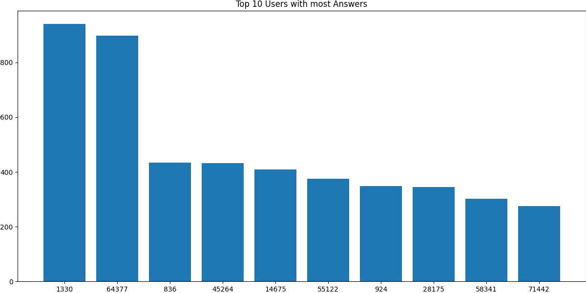
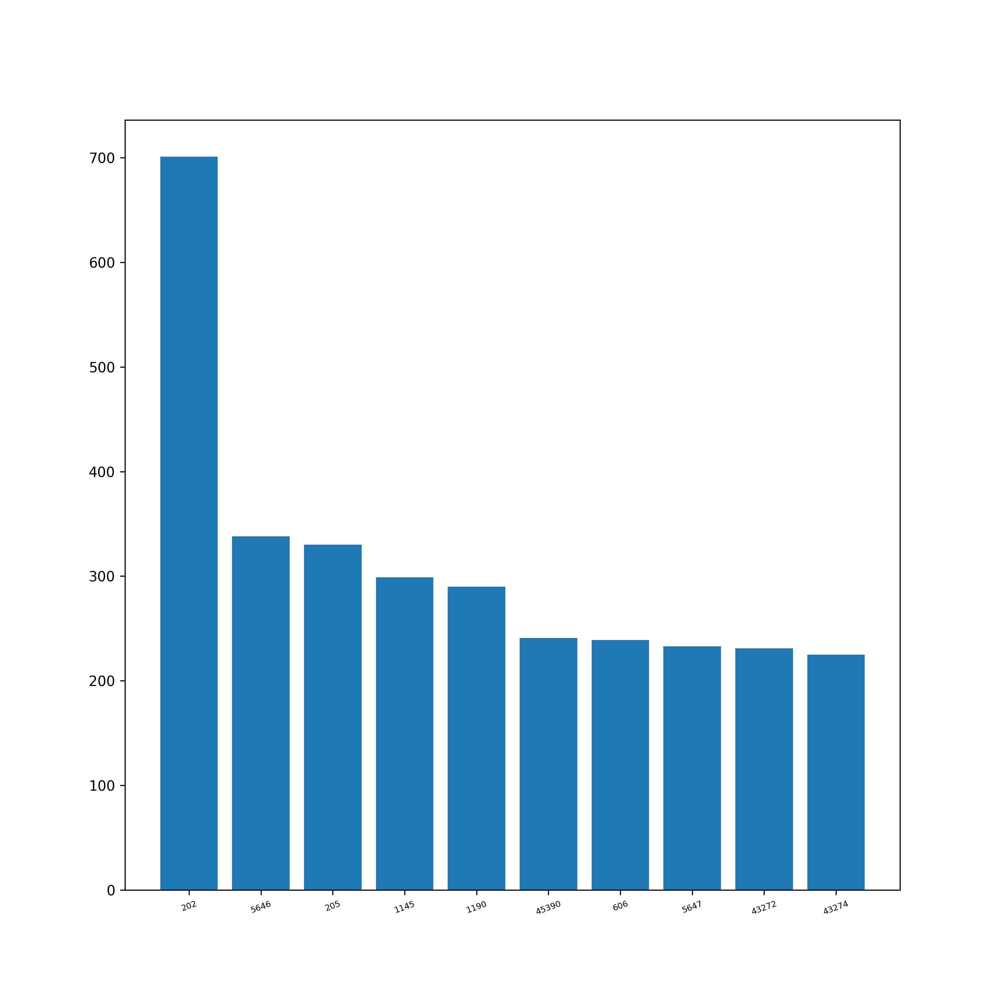
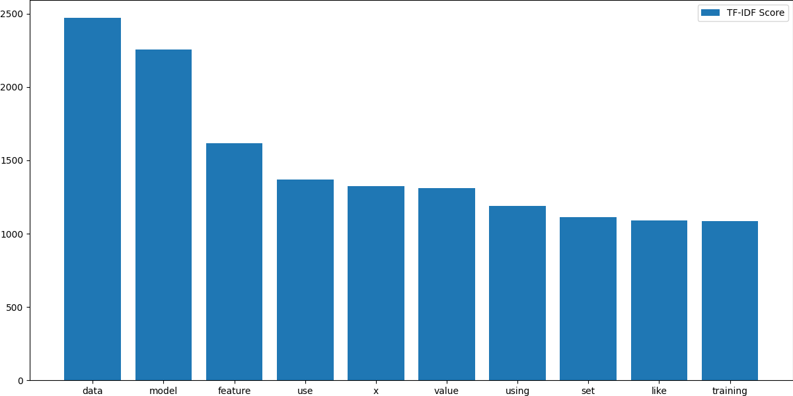

# datascience.stackexchange.com

# Overall Insights

<div align="center">

| Metric                             | Value |
|:-----------------------------------|------:|
| Total Posts                        | 30336 |
| Total Answers                      | 33867 |
| Number of Users                    | 104884 |
| Number of Comments                 | 25970 |
| Number of Votes                    | 195799 |
| Number of Badges Awarded           | 120125 |
| Number of Tags                     | 648   |
| <hr/>                              | <hr/> |
| Total Reputation Points            |5297756|
| Average Reputation per User        | 50.51 |
| <hr/>                              | <hr/> |
| Average Comment Score            | 0.23 |
| Average Comments per Post          | 2.59  |
| Average Comments per User          | 5.36 |
| Average Favorites per User         | 2.47  |
| Average Favorites per Post         | 2.63  |
| Average Upvote per Post            | 2.33  |
| Average Downvote per Post          | 0.23  |
| <hr/>                              | <hr/> |
| Total Closed Posts                 | 2061  |
| Total Open Posts                   | 28275 |
| Number of Posts with Related posts | 2392  |
| Average number of Related posts    | 1.15  |
| Number of Posts with Duplicates    | 249  |
| Number of Duplicate Posts          | 259  |

</div>
<br/>

<div style="page-break-after: always;"></div>

# Posts

## Most Viewed Questions


## Most Answered Questions


<div style="page-break-after: always;"></div>

## Most Commented Questions


## Highest Scored Questions


<div style="page-break-after: always;"></div>

## Users With Most Questions Asked


## Users with Most Answers Written



## Graphs

**Warning**: Render times extremely high since the graphs are huge.

Post Graph: View it [here](http://stackexchange-miner.web.app/datascience.stackexchange.com/post_graph.html)

User Graph: View it [here](http://stackexchange-miner.web.app/datascience.stackexchange.com/user_graph.html)

<div style="page-break-after: always;"></div>

# PostLinks

## Posts with Most Related Posts


<div style="page-break-after: always;"></div>

## Posts with Most Duplicates


## Post Relation Graph

Please view it [here](http://stackexchange-miner.web.app/datascience.stackexchange.com/static_graph.html)

<div style="page-break-after: always;"></div>

# PostHistory

<div align="center">

| Event                                  |Number |
|----------------------------------------|------:|
| Edit Body                              | 33510 |
| Edit Title                             | 3885   |
| Edit Tags                              | 4492  |
| Rollback Body                          | 106   |
| Rollback Title                         | 10   |
| Rollback Tags                          | 7    |
| Post Closed                            | 2170  |
| Post Reopened                          | 246   |
| Community Owned                        | 82   |
| Post Migrated from Other SEs           | 182  |
| Post Migrated to Other SEs             | 15    |
| Post Merge Destination                 | 6   |
| Post Merge Source                      | 2    |
| Post Locked                            | 22   |
| Post Unlocked                          | 18    |
| Post Deleted                           | 266   |
| Post Undeleted                         | 266   |
| Post Protected                         | 86   |
| Post Unprotected                       | 1     |
| Marked as Highly Active                | 456   |
| Unmarked as Highly Active              | 7    |

</div>


## Post Close Reason

<div align="center">

| Reason                                 |Number |
|----------------------------------------|------:|
| Duplicate                              | 164  |
| Not a question                         | 0   |
| Opinion-based                          | 227    |
| Localized                              | 0     |
| Subjective                             | 0     |
| Pointless                              | 0     |
| Unclear                                | 583   |
| General Reference                      | 0     |
| Off-topic                              | 606   |
| Too broad                              | 590   |

</div>


## Average Edits per Post

<div align="center">

| Type   | Value |
|--------|------:|
| Title  | 1.12  |
| Body   | 1.53  |
| Tags   | 1.12  |

</div>

## Average Rollbacks per Post

<div align="center">

| Type   | Value |
|--------|------:|
| Title  | 1.06  |
| Body   | 1.09  |
| Tags   | 1.0  |

</div>

<div style="page-break-after: always;"></div>

# Tags

## Tags Word Cloud

<div align="center">


</div>

<div style="page-break-after: always;"></div>

## Most Used Tags


<div style="page-break-after: always;"></div>

# Votes

## Total Votes


<!--  -->


<div align="center">

| Category      | Votes     |
|:---------------|----------:|
| Total         | 195799    |
| Accepted      | 10226     |
| Upvote        | 141903    |
| Downvote      | 13739    |
| Offensive     | 10        |
| Favorite      | 21898     |
| Close         | 0       |
| Reopen        | 0         |
| Bounty Start  | 505       |
| Bounty Close  | 505       |
| Delete        | 6589      |
| Undelete      | 286       |
| Spam          | 138       |

</div>

<div style="page-break-after: always;"></div>

## Special Types of Posts

<div align="center">


| Category     | Votes  |
|--------------|-------:|
| Spam         | 138    |
| Offensive    | 10     |
| Deleted      | 6816   |
| Undeleted    | 286    |
| Closed       | 0    |
| Reopened     | 0      |
| Favorited    | 8319   |
| Accepted     | 10226  |

</div>

<div style="page-break-after: always;"></div>

## Bounties

<div align="center">

| Category       | Value |
|----------------|------:|
| Opened         | 791   |
| Closed         | 505   |
| Average Bounty | 58.22 |

</div>
<!-- <br/> -->

## Most Voted Questions

<div align="center">



</div>

<div style="page-break-after: always;"></div>

## Most Upvoted Questions

<div align="center">


</div>

<div style="page-break-after: always;"></div>

## Most Downvoted Questions

<div align="center">


</div>

<div style="page-break-after: always;"></div>

##  Most Favorited Questions

<div align="center">


</div>

<div style="page-break-after: always;"></div>

# Comments

## Comments by Year

<div align="center">


</div>

<div style="page-break-after: always;"></div>

## Comments by Month

<div align="center">


</div>

<div style="page-break-after: always;"></div>

## Most Commented Posts

<div align="center">


</div>

<div style="page-break-after: always;"></div>

## Users with Most Comments

<div align="center">


</div>

<div style="page-break-after: always;"></div>

# Users

## Most Reputed Users

<div align="center">


</div>

## Data Extracted from User Profiles __(profiles.results.json)__

| Location | Name | Personal Website | Media Handles | Photo |
|--|--|--|--|--|

Example:

```
"1425205": {
    "name": "Koba",
    "site": "http://www.kobakhit.com/",
    "location": "Philadelphia, PA",
    "about": "<p>Currently, Business Intelligence Analyst at Philadelphia 76ers. Graduated from Drexel with a Master's in Business Analytics.</p>\n\n<p>I love building decision and information systems using python, R, Shiny, and aws.</p>\n",
    "links": [],
}
```
<div style="page-break-after: always;"></div>

# Badges

## Total Badges Awarded:

<div align="center">

| Category | Badges |
|----------|-------:|
| Total    | 120125 |
| Gold     | 1244    |
| Silver   | 9202  |
| Bronze   | 109588  |

</div>

## Badge Word Clouds

### Gold Badges

<div align="center">


</div>

<div style="page-break-after: always;"></div>

### Silver Badges

<div align="center">


</div>

<div style="page-break-after: always;"></div>

### Bronze Badges


<div style="page-break-after: always;"></div>

## Top 10 Badges

<div align="center">

| Rank | Gold            | Silver        | Bronze           |
|------|-----------------|---------------|------------------|
| 1    | Famous Question | Yearling      | Autobiographer   |
| 2    | Fanatic         | Notable Question       | Supporter        |
| 3    | Steward      | Necromancer      | Student          |
| 4    | Electorate   | Enthusiast   | Editor           |
| 5    | Great Question        | Enlightened   | Informed          |
| 6    | Great Answer | Good Answer   | Popular Question |
| 7    | Unsung Hero       | Good Question  | Informed         |
| 8    | Stellar Question        | Constituent    | Teacher          |
| 9    | Publicist     | Taxonomist | Tumbleweed     |
| 10   | Populist         | Favourite Question          | Custodian    |

</div>

## Badges Awarded Only Once

```
Sportsmanship
Pundit
```

<div style="page-break-after: always;"></div>

# Active Users Over Time

Net new users joining every month

<div align="center">


</div>

# Best Time to Ask a Question

Time of the day affecting questions and responses from the community:

<div align="center">

Hours in GMT


</div>

<div style="page-break-after: always;"></div>

# Voting vs. Reputation

Bar Graph of UpVote Rate vs Buckets of Reputation

<div align="center">


</div>

# Fastest Gun in the West

The first answers are almost always accepted.


<div style="page-break-after: always;"></div>

# MapReduce

## AboutMe of Users

<div align="center">


</div>

<!-- <div align="center"> -->


<!--  -->

<!-- </div> -->

<div style="page-break-after: always;"></div>

## Title of Posts

<div align="center">


</div>

<div align="center">


<!--  -->

</div>

<div style="page-break-after: always;"></div>

## Body of Posts

<div align="center">




</div>

<div style="page-break-after: always;"></div>

# Association Rule Mining

## Frequent Itemsets

### Tags

Shows last 10 itemsets. Entire list can be found at [ARM_badges_fits.csv](datascience.stackexchange.com/ARM_tags_fits.csv)

<div align="center">

|id|items|support|count|
|---|-------|---------|-------:|
|492|{feature-extraction,data,implementation}|0.0013|86|
|493|{feature-extraction,reshape,implementation}|0.0021|133|
|494|{feature-extraction,data,reshape}|0.002|132|
|495|{feature-extraction,reshape,least-squares-svm}|0.0021|136|
|496|{data,implementation,least-squares-svm}|0.0015|99|
|497|{data,reshape,implementation}|0.0097|627|
|498|{reshape,implementation,least-squares-svm}|0.0023|147|
|499|{data,reshape,least-squares-svm}|0.0026|169|
|500|{apache-pig,data,reshape,implementation}|0.0016|104|
|501|{data,game,reshape,implementation}|0.001|67|


</div>

### Badges

<div align="center">

Shows last 10 itemsets. Entire list can be found at [ARM_badges_fits.csv](datascience.stackexchange.com/ARM_tags_fits.csv)

|id|items|support|count|
|---|-------|---------|-------:|
|14|{Teacher}|0.0222|1180|
|15|{Announcer}|0.0243|1293|
|16|{Quorum}|0.031|1647|
|17|{Cleanup}|0.0343|1824|
|18|{Proofreader}|0.0412|2190|
|19|{Notable Question}|0.0486|2584|
|20|{Archaeologist}|0.0672|3575|
|21|{Popular Question}|0.1054|5606|
|22|{Curious}|0.2018|10731|
|23|{Steward}|0.3538|18816|


</div>

<div style="page-break-after: always;"></div>

## Association Rules

### Tags

Shows last 10 rules. Entire list can be found at [ARM_tags_mined.csv](datascience.stackexchange.com/ARM_tags_mined.csv)

|id|LHS|RHS|support|confidence|coverage|lift|count|
|--|---|---|-------|----------|--------|----|----:|
|704|{data,reshape}|{least-squares-svm}|0.0026|0.1009|0.0258|1.1676|169|
|705|{reshape,least-squares-svm}|{data}|0.0026|0.1078|0.0242|1.7146|169|
|706|{apache-pig,data,implementation}|{reshape}|0.0016|0.6624|0.0024|4.5128|104|
|707|{apache-pig,reshape,implementation}|{data}|0.0016|0.6541|0.0025|10.3989|104|
|708|{apache-pig,data,reshape}|{implementation}|0.0016|0.5977|0.0027|10.0493|104|
|709|{data,reshape,implementation}|{apache-pig}|0.0016|0.1659|0.0097|8.9488|104|
|710|{data,game,implementation}|{reshape}|0.001|0.349|0.003|2.3773|67|
|711|{game,reshape,implementation}|{data}|0.001|0.3964|0.0026|6.3029|67|
|712|{data,game,reshape}|{implementation}|0.001|0.3206|0.0032|5.3899|67|
|713|{data,reshape,implementation}|{game}|0.001|0.1069|0.0097|2.7908|67|


### Badges

Shows last 10 rules. Entire list can be found at [ARM_badges_mined.csv](datascience.stackexchange.com/ARM_badges_mined.csv)

|id|LHS|RHS|support|confidence|coverage|lift|count|
|--|---|---|-------|----------|--------|----|----:|
|2|{}|{Teacher}|0.0222|0.0222|1.0|1.0|1180|
|3|{}|{Announcer}|0.0243|0.0243|1.0|1.0|1293|
|4|{}|{Quorum}|0.031|0.031|1.0|1.0|1647|
|5|{}|{Cleanup}|0.0343|0.0343|1.0|1.0|1824|
|6|{}|{Proofreader}|0.0412|0.0412|1.0|1.0|2190|
|7|{}|{Notable Question}|0.0486|0.0486|1.0|1.0|2584|
|8|{}|{Archaeologist}|0.0672|0.0672|1.0|1.0|3575|
|9|{}|{Popular Question}|0.1054|0.1054|1.0|1.0|5606|
|10|{}|{Curious}|0.2018|0.2018|1.0|1.0|10731|
|11|{}|{Steward}|0.3538|0.3538|1.0|1.0|18816|

