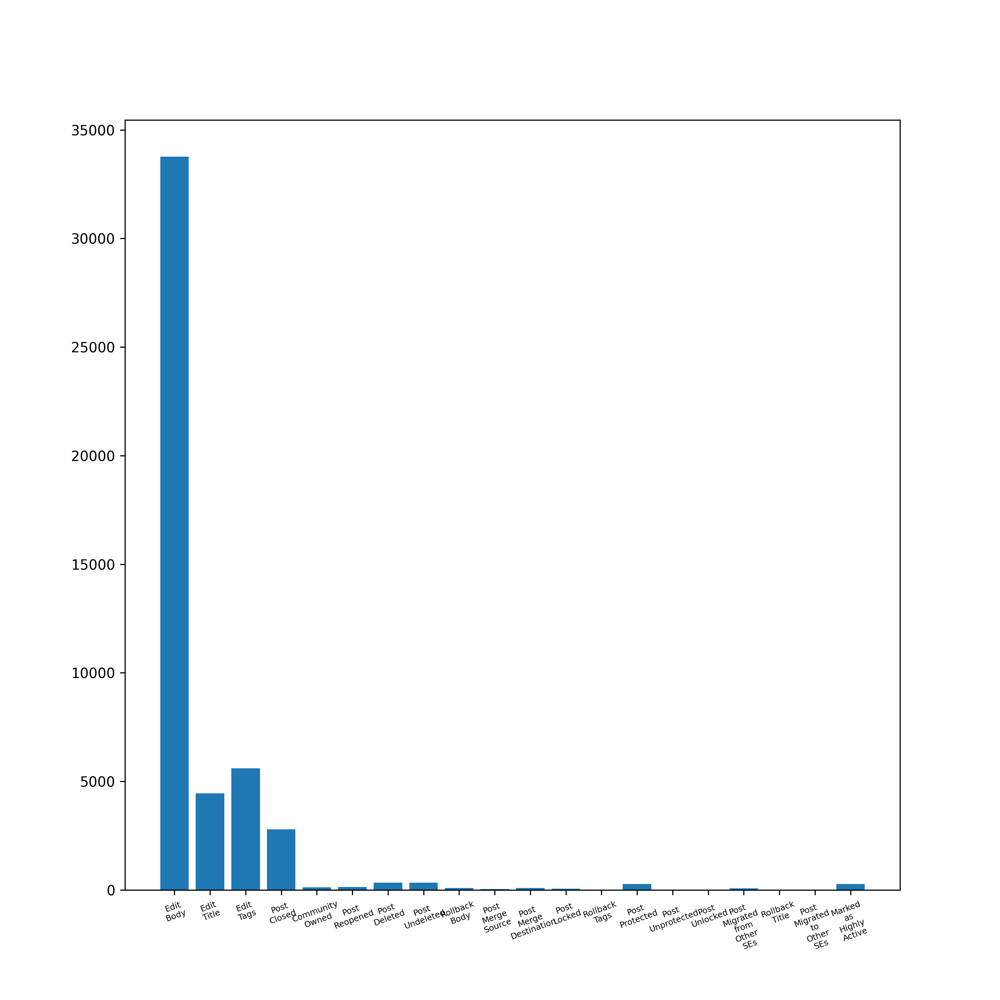
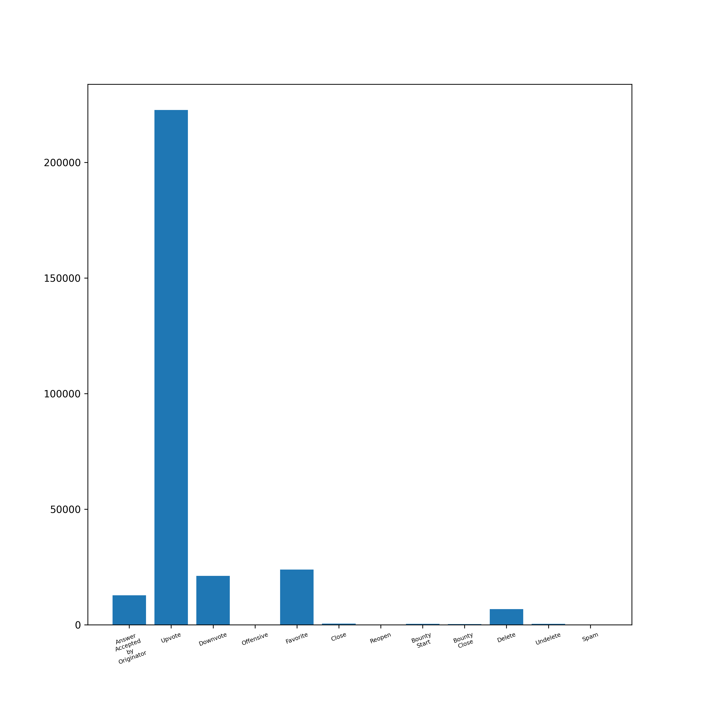

# ethereum.stackexchange.com

# Overall Insights

<div align="center">

| Metric                             | Value |
|:-----------------------------------|------:|
| Total Posts                        | 36987 |
| Total Answers                      | 41033 |
| Number of Users                    | 68574 |
| Number of Comments                 | 33506 |
| Number of Votes                    | 221689 |
| Number of Badges Awarded           | 93814 |
| Number of Tags                     | 800   |
| <hr/>                              | <hr/> |
| Total Reputation Points            |3608275|
| Average Reputation per User        | 52.62 |
| <hr/>                              | <hr/> |
| Average Comment Score              | 0.2  |
| Average Comments per Post          | 2.72  |
| Average Comments per User          | 8.13 |
| Average Favorites per User         | 4.43  |
| Average Favorites per Post         | 2.3  |
| Average Upvote per Post            | 2.55  |
| Average Downvote per Post          | 0.14  |
| <hr/>                              | <hr/> |
| Total Closed Posts                 | 2658  |
| Total Open Posts                   | 34329 |
| Number of Posts with Related posts | 8838  |
| Average number of Related posts    | 1.28 |
| Number of Posts with Duplicates    | 2290  |
| Number of Duplicate Posts          | 2417  |

</div>

<div style="page-break-after: always;"></div>


# Posts

## Most Viewed Questions


## Most Answered Questions


<div style="page-break-after: always;"></div>

## Most Commented Questions


## Highest Scored Questions


<div style="page-break-after: always;"></div>

## Users With Most Questions Asked


## Users with Most Answers Written


## Graphs

**Warning**: Render times extremely high since the graphs are huge.

Post Graph: View it [here](http://stackexchange-miner.web.app/ethereum.stackexchange.com/post_graph.html)

User Graph: View it [here](http://stackexchange-miner.web.app/ethereum.stackexchange.com/user_graph.html)

<div style="page-break-after: always;"></div>

# PostLinks

## Posts with Most Related Posts


<div style="page-break-after: always;"></div>

## Posts with Most Duplicates


## Post Relation Graph

Please view it [here](http://stackexchange-miner.web.app/ethereum.stackexchange.com/static_graph.html)

<div style="page-break-after: always;"></div>

# PostHistory

<div align="center">

| Event                                  |Number |
|----------------------------------------|------:|
| Edit Body                              | 33766 |
| Edit Title                             | 4451  |
| Edit Tags                              | 5599  |
| Post Closed                            | 2789  |
| Post Reopened                          | 131   |
| Rollback Tags                          | 12    |
| Community Owned                        | 130   |
| Post Migrated from Other SEs           | 73  |
| Post Merge Destination                 | 96   |
| Rollback Body                          | 87   |
| Post Merge Source                      | 42    |
| Post Locked                            | 58   |
| Post Deleted                           | 342   |
| Post Undeleted                         | 342   |
| Post Protected                         | 276   |
| Post Unprotected                       | 1     |
| Post Migrated to Other SEs             | 3    |
| Post Unlocked                          | 6    |
| Rollback Title                         | 20    |
| Marked as Highly Active                | 270   |

</div>




## Post Close Reason

<div align="center">

| Reason                                 |Number |
|----------------------------------------|------:|
| Duplicate                              | 1716   |
| Not a question                         | 0    |
| Opinion-based                          | 128    |
| Localized                              | 3     |
| Subjective                             | 0     |
| Pointless                              | 0     |
| Unclear                                | 303   |
| General Reference                      | 0     |
| Off-topic                              | 400   |
| Too broad                              | 242   |

</div>


## Average Edits per Post

<div align="center">

| Type   | Value |
|--------|------:|
| Title  | 1.15  |
| Body   | 1.54  |
| Tags   | 1.16  |

</div>

## Average Rollbacks per Post

<div align="center">

| Type   | Value |
|--------|------:|
| Title  | 1.11  |
| Body   | 1.1  |
| Tags   | 1.0  |

</div>

<div style="page-break-after: always;"></div>

# Tags

## Tags Word Cloud

<div align="center">


</div>
<div style="page-break-after: always;"></div>

## Most Used Tags

<div align="center">


</div>
<div style="page-break-after: always;"></div>

# Votes

## Total Votes


<!--  -->


<div align="center">

| Category      | Votes     |
|:---------------|----------:|
| Total         | 221689    |
| Accepted      | 14422     |
| Upvote        | 166201    |
| Downvote      | 9331     |
| Offensive     | 20        |
| Favorite      | 20807     |
| Close         | 0       |
| Reopen        | 0         |
| Bounty Start  | 409       |
| Bounty Close  | 406       |
| Delete        | 9594      |
| Undelete      | 348       |
| Spam          | 151       |

</div>

<div style="page-break-after: always;"></div>

## Special Types of Posts

<div align="center">


| Category     | Votes  |
|--------------|-------:|
| Spam         | 151    |
| Offensive    | 20     |
| Deleted      |7859   |
| Undeleted    | 348    |
| Closed       | 0    |
| Reopened     | 0      |
| Favorited    | 9055   |
| Accepted     | 14422  |

</div>

<div style="page-break-after: always;"></div>

## Bounties

<div align="center">

| Category       | Value |
|----------------|------:|
| Opened         | 645   |
| Closed         | 406   |
| Average Bounty | 62.64 |

</div>
<!-- <br/> -->

## Most Voted Questions

<div align="center">


</div>

<div style="page-break-after: always;"></div>

## Most Upvoted Questions

<div align="center">


</div>

<div style="page-break-after: always;"></div>

## Most Downvoted Questions

<div align="center">


</div>

<div style="page-break-after: always;"></div>

##  Most Favorited Questions

<div align="center">


</div>

<div style="page-break-after: always;"></div>

# Comments

## Comments by Year

<div align="center">


</div>

<div style="page-break-after: always;"></div>

## Comments by Month

<div align="center">


</div>

<div style="page-break-after: always;"></div>

## Most Commented Posts

<div align="center">


</div>

<div style="page-break-after: always;"></div>

## Users with Most Comments

<div align="center">


</div>

<div style="page-break-after: always;"></div>

# Users

## Most Reputed Users

<div align="center">


</div>

## Data Extracted from User Profiles __(profiles.results.json)__

| Location | Name | Personal Website | Media Handles | Photo |
|--|--|--|--|--|

Example:

```
	"21100315": {
		"name": "Uniqueka Davis-McKinney",
		"site": "https://uniquekadavismckinney.com/",
		"location": "Washington, D.C., USA",
		"links": [
			"https://www.facebook.com/uniqueka.mckinney.3",
			"https://www.facebook.com/uniqueka.mckinney.3",
			"https://www.instagram.com/uniqueka_mckinney/",
			"https://www.instagram.com/uniqueka_mckinney/"
		],
	}
```
<div style="page-break-after: always;"></div>

# Badges

## Total Badges Awarded:

<div align="center">

| Category | Badges |
|----------|-------:|
| Total    | 93814 |
| Gold     | 973    |
| Silver   | 9347  |
| Bronze   | 83323  |

</div>

## Badge Word Clouds

### Gold Badges

<div align="center">


</div>

<div style="page-break-after: always;"></div>

### Silver Badges

<div align="center">


</div>

<div style="page-break-after: always;"></div>

### Bronze Badges


<div style="page-break-after: always;"></div>

## Top 10 Badges

<div align="center">

| Rank | Gold            | Silver        | Bronze           |
|------|-----------------|---------------|------------------|
| 1    | Famous Question | Notable Question      | Autobiographer   |
| 2    | Fanatic         | Yearling       | Supporter        |
| 3    | Publicist      | Enlightened      | Student          |
| 4    | Unsung Hero   | Necromancer   | Informed           |
| 5    | Steward         | Good Answer   | Popular Question          |
| 6    | Electorate  | Good Question   | Editor |
| 7    | Great Question       | Constitutent   | Scholar        |
| 8    | Great Answer        | Enthusiast    | Teacher          |
| 9    | Populist    | Booster | Tumbleweed      |
| 10   | Stellar Question         | Guru          | Custodian    |

</div>

## Badges Awarded Only Once

```
Lifejacket
```

<div style="page-break-after: always;"></div>

# Active Users Over Time

Net new users joining every month

<div align="center">


</div>

# Best Time to Ask a Question

Time of the day affecting questions and responses from the community:

<div align="center">

Hours in GMT


</div>

<div style="page-break-after: always;"></div>

# Voting vs. Reputation

Bar Graph of UpVote Rate vs Buckets of Reputation

<div align="center">


</div>

# Fastest Gun in the West

The first answers are almost always accepted.


<div style="page-break-after: always;"></div>

# MapReduce

## AboutMe of Users

<div align="center">


</div>

<!-- <div align="center"> -->


<!--  -->

<!-- </div> -->

<div style="page-break-after: always;"></div>

## Title of Posts

<div align="center">


</div>

<div align="center">


<!--  -->

</div>

<div style="page-break-after: always;"></div>

## Body of Posts

<div align="center">


</div>

<div style="page-break-after: always;"></div>

# Association Rule Mining

## Frequent Itemsets

### Tags

Shows last 10 itemsets. Entire list can be found at [ARM_badges_fits.csv](ethereum.stackexchange.com/ARM_tags_fits.csv)

<div align="center">

|id|items|support|count|
|---|-------|---------|-------:|
|289|{twofish,number-field-sieve}|0.0015|88|
|290|{twofish,terminology}|0.0018|104|
|291|{visual-ethereumgraphy,number-field-sieve}|0.0093|538|
|292|{timestamping,visual-ethereumgraphy}|0.0012|70|
|293|{terminology,visual-ethereumgraphy}|0.008|465|
|294|{encryption,number-field-sieve}|0.0016|91|
|295|{terminology,number-field-sieve}|0.0069|399|
|296|{encryption,terminology}|0.0092|535|
|297|{terminology,timestamping}|0.0043|251|
|298|{terminology,visual-ethereumgraphy,number-field-sieve}|0.0026|149|

</div>

### Badges

<div align="center">

Shows last 10 itemsets. Entire list can be found at [ARM_badges_fits.csv](ethereum.stackexchange.com/ARM_tags_fits.csv)

|id|items|support|count|
|---|-------|---------|-------:|
|19|{Caucus}|0.0207|885|
|20|{Teacher}|0.0214|916|
|21|{Proofreader}|0.023|983|
|22|{Civic Duty}|0.0399|1708|
|23|{Synonymizer}|0.0408|1747|
|24|{Scholar}|0.0444|1900|
|25|{Refiner}|0.058|2482|
|26|{Excavator}|0.0838|3585|
|27|{Tumbleweed}|0.2439|10436|
|28|{Electorate}|0.3648|15611|

</div>

<div style="page-break-after: always;"></div>

## Association Rules

### Tags

Shows last 10 rules. Entire list can be found at [ARM_tags_mined.csv](ethereum.stackexchange.com/ARM_tags_mined.csv)

|id|LHS|RHS|support|confidence|coverage|lift|count|
|--|---|---|-------|----------|--------|----|----:|
|257|{encryption}|{number-field-sieve}|0.0016|0.0403|0.0389|0.9905|91|
|258|{number-field-sieve}|{terminology}|0.0069|0.1691|0.0407|2.4348|399|
|259|{terminology}|{number-field-sieve}|0.0069|0.099|0.0695|2.4348|399|
|260|{encryption}|{terminology}|0.0092|0.2367|0.0389|3.4078|535|
|261|{terminology}|{encryption}|0.0092|0.1327|0.0695|3.4078|535|
|262|{timestamping}|{terminology}|0.0043|0.0988|0.0438|1.422|251|
|263|{terminology}|{timestamping}|0.0043|0.0623|0.0695|1.422|251|
|264|{visual-ethereumgraphy,number-field-sieve}|{terminology}|0.0026|0.277|0.0093|3.9868|149|
|265|{terminology,visual-ethereumgraphy}|{number-field-sieve}|0.0026|0.3204|0.008|7.8821|149|
|266|{terminology,number-field-sieve}|{visual-ethereumgraphy}|0.0026|0.3734|0.0069|11.3811|149|


### Badges

Shows last 9 rules. Entire list can be found at [ARM_badges_mined.csv](ethereum.stackexchange.com/ARM_badges_mined.csv)

|id|LHS|RHS|support|confidence|coverage|lift|count|
|--|---|---|-------|----------|--------|----|----:|
|2|{}|{Teacher}|0.0214|0.0214|1.0|1.0|916|
|3|{}|{Proofreader}|0.023|0.023|1.0|1.0|983|
|4|{}|{Civic Duty}|0.0399|0.0399|1.0|1.0|1708|
|5|{}|{Synonymizer}|0.0408|0.0408|1.0|1.0|1747|
|6|{}|{Scholar}|0.0444|0.0444|1.0|1.0|1900|
|7|{}|{Refiner}|0.058|0.058|1.0|1.0|2482|
|8|{}|{Excavator}|0.0838|0.0838|1.0|1.0|3585|
|9|{}|{Tumbleweed}|0.2439|0.2439|1.0|1.0|10436|
|10|{}|{Electorate}|0.3648|0.3648|1.0|1.0|15611|
