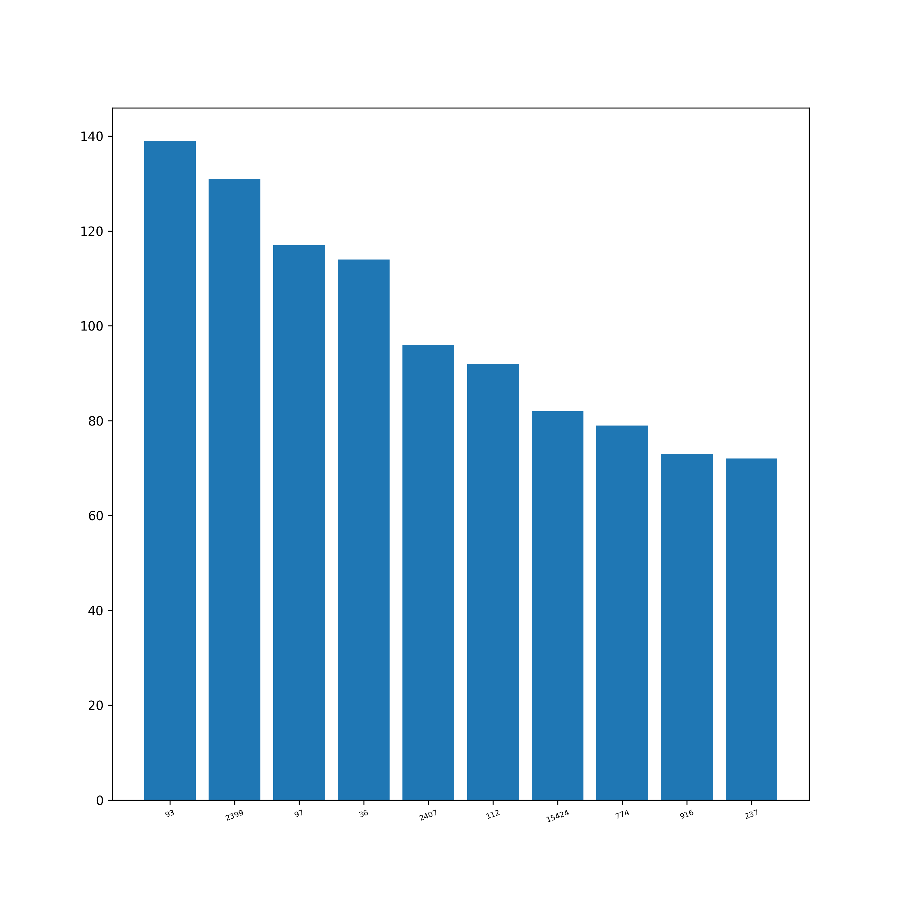
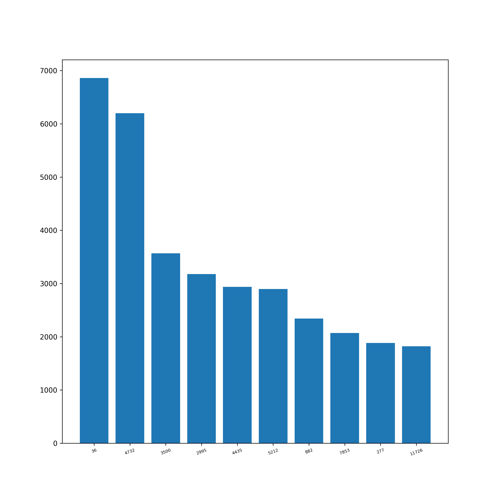
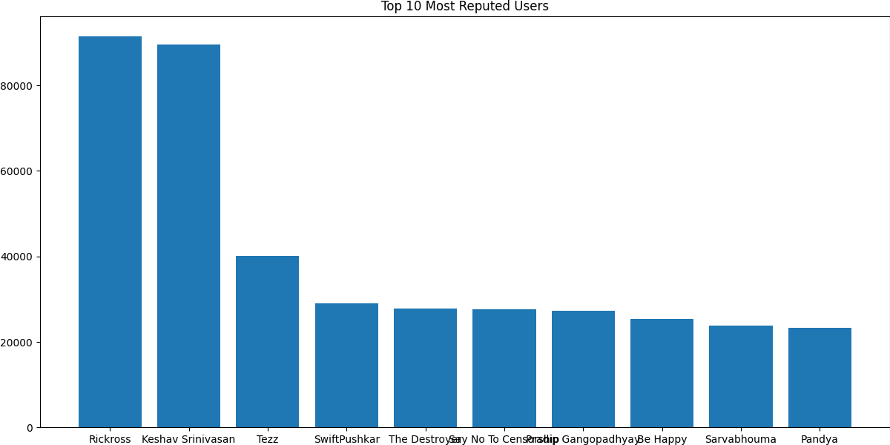

# hinduism.stackexchange.com

# Overall Insights

<div align="center">

| Metric                             | Value |
|:-----------------------------------|------:|
| Total Posts                        | 14402 |
| Total Answers                      | 16367 |
| Number of Users                    | 18641  |
| Number of Comments                 | 20627 |
| Number of Votes                    | 181496 |
| Number of Badges Awarded           | 34159 |
| Number of Tags                     | 782   |
| <hr/>                              | <hr/> |
| Total Reputation Points            |1786791|
| Average Reputation per User        | 96.68 |
| <hr/>                              | <hr/> |
| Average Comment Score              | 0.5  |
| Average Comments per Post          | 4.3  |
| Average Comments per User          | 37.5 |
| Average Favorites per User         | 8.27  |
| Average Favorites per Post         | 1.86  |
| Average Upvote per Post            | 3.9  |
| Average Downvote per Post          | 0.56  |
| <hr/>                              | <hr/> |
| Total Closed Posts                 | 1945  |
| Total Open Posts                   | 12457 |
| Number of Posts with Related posts | 7198  |
| Average number of Related posts    | 1.66  |
| Number of Posts with Duplicates    | 1908  |
| Number of Duplicate Posts          | 2081  |

</div>
<br/>

<div style="page-break-after: always;"></div>

# Posts

## Most Viewed Questions


## Most Answered Questions


<div style="page-break-after: always;"></div>

## Most Commented Questions


## Highest Scored Questions


<div style="page-break-after: always;"></div>

## Users With Most Questions Asked


## Users with Most Answers Written


## Graphs

**Warning**: Render times extremely high since the graphs are huge.

Post Graph: View it [here](http://stackexchange-miner.web.app/hinduism.stackexchange.com/post_graph.html)

User Graph: View it [here](http://stackexchange-miner.web.app/hinduism.stackexchange.com/user_graph.html)

<div style="page-break-after: always;"></div>

# PostLinks

## Posts with Most Related Posts


<div style="page-break-after: always;"></div>

## Posts with Most Duplicates


## Post Relation Graph

Please view it [here](http://stackexchange-miner.web.app/hinduism.stackexchange.com/static_graph.html)

<div style="page-break-after: always;"></div>

# PostHistory

<div align="center">

| Event                                  |Number |
|----------------------------------------|------:|
| Edit Body                              | 40586 |
| Edit Title                             | 7740  |
| Edit Tags                              | 7805  |
| Rollback Body                          | 293   |
| Rollback Title                         | 111    |
| Rollback Tags                          | 57    |
| Post Closed                            | 2253  |
| Post Reopened                          | 308   |
| Community Owned                        | 82   |
| Post Tweeted                           | 10108 |
| Post Migrated from Other SEs           | 20  |
| Post Migrated to Other SEs             | 1    |
| Post Merge Destination                 | 8   |
| Post Merge Source                      | 5    |
| Post Locked                            | 23   |
| Post Unlocked                          | 13    |
| Post Deleted                           | 311   |
| Post Undeleted                         | 312   |
| Post Protected                         | 473   |
| Post Unprotected                       | 22     |
| Marked as Highly Active                | 442   |
| Unmarked as Highly Active              | 1    |

</div>


## Post Close Reason

<div align="center">

| Reason                                 |Number |
|----------------------------------------|------:|
| Duplicate                              | 1463  |
| Not a question                         | 0   |
| Opinion-based                          | 241    |
| Localized                              | 0     |
| Subjective                             | 0     |
| Pointless                              | 0     |
| Unclear                                | 98   |
| General Reference                      | 0     |
| Off-topic                              | 343   |
| Too broad                              | 108   |


</div>


## Average Edits per Post

<div align="center">

| Type   | Value |
|--------|------:|
| Title  | 1.43  |
| Body   | 2.21  |
| Tags   | 1.38  |

</div>

## Average Rollbacks per Post

<div align="center">

| Type   | Value |
|--------|------:|
| Title  | 1.39  |
| Body   | 1.39  |
| Tags   | 1.51  |

</div>

<div style="page-break-after: always;"></div>

# Tags

## Tags Word Cloud

<div align="center">


</div>
<div style="page-break-after: always;"></div>

## Most Used Tags


<div style="page-break-after: always;"></div>

# Votes

## Total Votes


<!--  -->


<div align="center">

| Category      | Votes     |
|:---------------|----------:|
| Total         | 181496    |
| Accepted      | 4726     |
| Upvote        | 139896   |
| Downvote      | 20142     |
| Offensive     | 201        |
| Favorite      | 8928     |
| Close         | 0       |
| Reopen        | 0         |
| Bounty Start  | 395       |
| Bounty Close  | 391       |
| Delete        | 6225      |
| Undelete      | 322       |
| Spam          | 270       |


</div>

<div style="page-break-after: always;"></div>

## Special Types of Posts

<div align="center">


| Category     | Votes  |
|--------------|-------:|
| Spam         | 270    |
| Offensive    | 201     |
| Deleted      | 5338   |
| Undeleted    | 291    |
| Closed       | 0    |
| Reopened     | 0      |
| Favorited    | 4794   |
| Accepted     | 4726  |

</div>

<div style="page-break-after: always;"></div>

## Bounties

<div align="center">

| Category       | Value |
|----------------|------:|
| Opened         | 575   |
| Closed         | 391   |
| Average Bounty | 95.87 |

</div>
<!-- <br/> -->

## Most Voted Questions

<div align="center">



</div>

<div style="page-break-after: always;"></div>

## Most Upvoted Questions

<div align="center">


</div>

<div style="page-break-after: always;"></div>

## Most Downvoted Questions

<div align="center">


</div>

<div style="page-break-after: always;"></div>

##  Most Favorited Questions

<div align="center">


</div>

<div style="page-break-after: always;"></div>

# Comments

## Comments by Year

<div align="center">


</div>

<div style="page-break-after: always;"></div>

## Comments by Month

<div align="center">


</div>

<div style="page-break-after: always;"></div>

## Most Commented Posts

<div align="center">


</div>

<div style="page-break-after: always;"></div>

## Users with Most Comments

<div align="center">



</div>

<div style="page-break-after: always;"></div>

# Users

## Most Reputed Users

<div align="center">



</div>

## Data Extracted from User Profiles __(profiles.results.json)__

| Location | Name | Personal Website | Media Handles | Photo |
|--|--|--|--|--|

Example:

```
"1931402": {
    "name": "Harikrishnan",
    "site": "http://about.me/harikrishnanp",
    "location": "Kochi, Kerala, India",
    "links": [
        "http://in.linkedin.com/pub/harikrishnan-p/22/795/aa9/en",
        "https://stackexchange.com/users/1931402",
        "https://stackexchange.com/users/flair/1931402.png"
    ],
    "photo": "https://i.stack.imgur.com/phIae.jpg?s=128&g=1"
}
```
<div style="page-break-after: always;"></div>

# Badges

## Total Badges Awarded:

<div align="center">

| Category | Badges |
|----------|-------:|
| Total    | 34159 |
| Gold     | 590    |
| Silver   | 5457  |
| Bronze   | 27924  |

</div>

## Badge Word Clouds

### Gold Badges

<div align="center">


</div>

<div style="page-break-after: always;"></div>

### Silver Badges

<div align="center">


</div>

<div style="page-break-after: always;"></div>

### Bronze Badges


<div style="page-break-after: always;"></div>

## Top 10 Badges

<div align="center">

| Rank | Gold            | Silver        | Bronze           |
|------|-----------------|---------------|------------------|
| 1    | Famous Question | Notable Question       | Autobiographer   |
| 2    | Fanatic         | Yearling      | Popular Question        |
| 3    | Electorate      | Necromancer      | Student          |
| 4    | Socratic    | Enlightened   | Supporter           |
| 5    | Constable         | Enthusiast    | Informed         |
| 6    | Copy Editor   | Constituent   | Teacher  |
| 7    | Marshal       | Good Question   | Editor         |
| 8    | Steward       | Civic Duty   | Nice Question         |
| 9    | Populist    | Good Answer | Revival      |
| 10   | Great Answer        | Inquisitive          | Nice Answer    |

</div>

## Badges Awarded Only Once

```
Populist
Great Answer
Research Assistant
```

<div style="page-break-after: always;"></div>

# Active Users Over Time

Net new users joining every month

<div align="center">


</div>

# Best Time to Ask a Question

Time of the day affecting questions and responses from the community:

<div align="center">

Hours in GMT


</div>

<div style="page-break-after: always;"></div>

# Voting vs. Reputation

Bar Graph of UpVote Rate vs Buckets of Reputation

<div align="center">


</div>

# Fastest Gun in the West

The first answers are almost always accepted.


<div style="page-break-after: always;"></div>

# MapReduce

## AboutMe of Users

<div align="center">


</div>

<!-- <div align="center"> -->


<!--  -->

<!-- </div> -->

<div style="page-break-after: always;"></div>

## Title of Posts

<div align="center">


</div>

<div align="center">


<!--  -->

</div>

<div style="page-break-after: always;"></div>

## Body of Posts

<div align="center">


</div>

<div style="page-break-after: always;"></div>

# Association Rule Mining

## Frequent Itemsets

### Tags

Shows last 10 itemsets. Entire list can be found at [ARM_tags_fits.csv](hinduism.stackexchange.com/ARM_tags_fits.csv)

<div align="center">

|id|items|support|count|
|---|-------|---------|-------:|
|379|{priests,devtas}|0.0018|56|
|380|{priests,kumarila-bhatta}|0.0025|78|
|381|{kumarila-bhatta,devtas}|0.0073|230|
|382|{evil,yoga-vashishtha,priests}|0.0015|46|
|383|{yama,nimbarkacharya,prisoners}|0.001|33|
|384|{samskara,lalita-sahasranama,exaltation}|0.0016|50|
|385|{non-attachment,title,exaltation}|0.0012|38|
|386|{teaching,nimbarkacharya,prisoners}|0.001|32|
|387|{appayya-dikshitar,kumarila-bhatta,devtas}|0.0013|42|
|388|{kumarila-bhatta,lalita-sahasranama,devtas}|0.001|33|


</div>

### Badges

<div align="center">

Shows last 10 itemsets. Entire list can be found at [ARM_badges_fits.csv](hinduism.stackexchange.com/ARM_badges_fits.csv)

|id|items|support|count|
|---|-------|---------|-------:|
|20|{Vox Populi}|0.0113|105|
|21|{Student}|0.024|224|
|22|{Caucus}|0.0264|246|
|23|{Commentator}|0.0328|306|
|24|{Guru}|0.0382|356|
|25|{Explainer}|0.0844|786|
|26|{Generalist}|0.0986|919|
|27|{Investor}|0.1046|974|
|28|{Altruist}|0.1198|1116|
|29|{Copy Editor}|0.3669|3418|


</div>

<div style="page-break-after: always;"></div>

## Association Rules

### Tags

Shows last 10 rules. Entire list can be found at [ARM_tags_mined.csv](hinduism.stackexchange.com/ARM_tags_mined.csv)

|id|LHS|RHS|support|confidence|coverage|lift|count|
|--|---|---|-------|----------|--------|----|----:|
|360|{title,exaltation}|{non-attachment}|0.0012|0.3393|0.0035|33.4963|38|
|361|{teaching,prisoners}|{nimbarkacharya}|0.001|0.2667|0.0038|16.0056|32|
|362|{teaching,nimbarkacharya}|{prisoners}|0.001|0.4571|0.0022|32.7027|32|
|363|{nimbarkacharya,prisoners}|{teaching}|0.001|0.25|0.004|20.4722|32|
|364|{appayya-dikshitar,devtas}|{kumarila-bhatta}|0.0013|0.2642|0.005|5.0581|42|
|365|{appayya-dikshitar,kumarila-bhatta}|{devtas}|0.0013|0.25|0.0053|5.6031|42|
|366|{kumarila-bhatta,devtas}|{appayya-dikshitar}|0.0013|0.1826|0.0073|6.163|42|
|367|{lalita-sahasranama,devtas}|{kumarila-bhatta}|0.001|0.3626|0.0029|6.944|33|
|368|{kumarila-bhatta,lalita-sahasranama}|{devtas}|0.001|0.2171|0.0048|4.8658|33|
|369|{kumarila-bhatta,devtas}|{lalita-sahasranama}|0.001|0.1435|0.0073|3.9573|33|


### Badges

Shows last 10 rules. Entire list can be found at [ARM_badges_mined.csv](hinduism.stackexchange.com/ARM_badges_mined.csv)

|id|LHS|RHS|support|confidence|coverage|lift|count|
|--|---|---|-------|----------|--------|----|----:|
|3|{}|{Vox Populi}|0.0113|0.0113|1.0|1.0|105|
|4|{}|{Student}|0.024|0.024|1.0|1.0|224|
|5|{}|{Caucus}|0.0264|0.0264|1.0|1.0|246|
|6|{}|{Commentator}|0.0328|0.0328|1.0|1.0|306|
|7|{}|{Guru}|0.0382|0.0382|1.0|1.0|356|
|8|{}|{Explainer}|0.0844|0.0844|1.0|1.0|786|
|9|{}|{Generalist}|0.0986|0.0986|1.0|1.0|919|
|10|{}|{Investor}|0.1046|0.1046|1.0|1.0|974|
|11|{}|{Altruist}|0.1198|0.1198|1.0|1.0|1116|
|12|{}|{Copy Editor}|0.3669|0.3669|1.0|1.0|3418|
