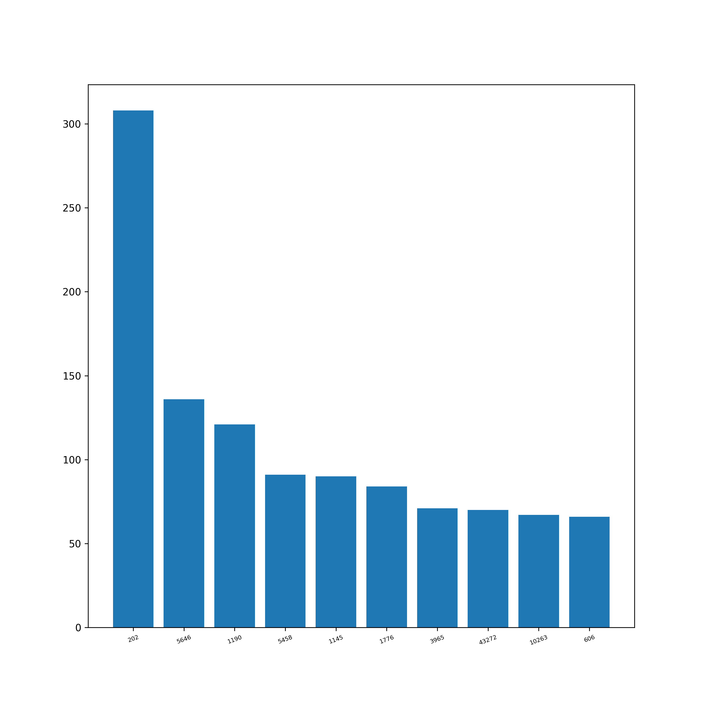
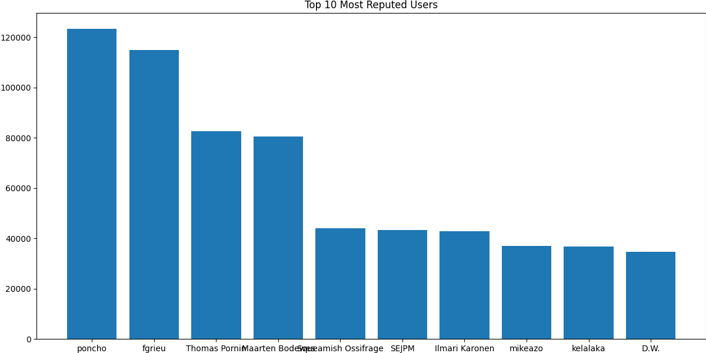
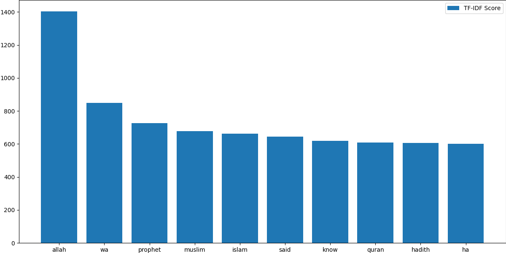

# islam.stackexchange.com

# Overall Insights

<div align="center">

| Metric                             | Value |
|:-----------------------------------|------:|
| Total Posts                        | 13435 |
| Total Answers                      | 20237 |
| Number of Users                    | 30240 |
| Number of Comments                 | 16474 |
| Number of Votes                    | 144655|
| Number of Badges Awarded           | 39988|
| Number of Tags                     | 555   |
| <hr/>                              | <hr/> |
| Total Reputation Points            |1313750|
| Average Reputation per User        | 43.44 |
| <hr/>                              | <hr/> |
| Average Comment Score              | 0.37 |
| Average Comments per Post          | 2.55  |
| Average Comments per User          | 14.09 |
| Average Favorites per User         | 4.51  |
| Average Favorites per Post         | 1.54  |
| Average Upvote per Post            | 1.68  |
| Average Downvote per Post          | 0.9  |
| <hr/>                              | <hr/> |
| Total Closed Posts                 | 1625  |
| Total Open Posts                   | 11810 |
| Number of Posts with Related posts | 5288  |
| Average number of Related posts    | 1.43  |
| Number of Posts with Duplicates    | 1760  |
| Number of Duplicate Posts          | 1831  |

</div>

<div style="page-break-after: always;"></div>


# Posts

## Most Viewed Questions


****

## Most Answered Questions


<div style="page-break-after: always;"></div>

## Most Commented Questions


## Highest Scored Questions


<div style="page-break-after: always;"></div>

## Users With Most Questions Asked


## Users with Most Answers Written


## Graphs

**Warning**: Render times extremely high since the graphs are huge.

Post Graph: View it [here](http://stackexchange-miner.web.app/islam.stackexchange.com/post_graph.html)

User Graph: View it [here](http://stackexchange-miner.web.app/islam.stackexchange.com/user_graph.html)

<div style="page-break-after: always;"></div>

# PostLinks

## Posts with Most Related Posts


<div style="page-break-after: always;"></div>

## Posts with Most Duplicates


## Post Relation Graph

Please view it [here](http://stackexchange-miner.web.app/islam.stackexchange.com/static_graph.html)

<div style="page-break-after: always;"></div>

# PostHistory

<div align="center">

| Event                                  |Number |
|----------------------------------------|------:|
| Edit Body                              | 31087 |
| Edit Title                             | 6334  |
| Edit Tags                              | 8280  |
| Post Closed                            | 1745  |
| Post Reopened                          | 120   |
| Rollback Tags                          | 56    |
| Community Owned                        | 59   |
| Post Tweeted                           | 4559 |
| Post Migrated from Other SEs           | 10  |
| Post Merge Destination                 | 45   |
| Rollback Body                          | 221   |
| Post Merge Source                      | 13    |
| Post Locked                            | 35   |
| Post Deleted                           | 268   |
| Post Undeleted                         | 268   |
| Post Protected                         | 656   |
| Post Unprotected                       | 2     |
| Post Migrated to Other SEs             | 2    |
| Post Unlocked                          | 21    |
| Rollback Title                         | 76    |
| Marked as Highly Active                | 75   |
| Unmarked as Highly Active              | 32    |

</div>


## Post Close Reason

<div align="center">

| Reason                                 |Number |
|----------------------------------------|------:|
| Duplicate                              | 1026   |
| Not a question                         | 18    |
| Opinion-based                          | 161    |
| Localized                              | 2     |
| Subjective                             | 16     |
| Pointless                              | 0     |
| Unclear                                | 213   |
| General Reference                      | 0     |
| Off-topic                              | 213   |
| Too broad                              | 96   |

</div>


## Average Edits per Post

<div align="center">

| Type   | Value |
|--------|------:|
| Title  | 1.31  |
| Body   | 1.88  |
| Tags   | 1.39  |

</div>

## Average Rollbacks per Post

<div align="center">

| Type   | Value |
|--------|------:|
| Title  | 1.27  |
| Body   | 1.26  |
| Tags   | 1.27  |

</div>

<div style="page-break-after: always;"></div>

# Tags

## Tags Word Cloud

<div align="center">


</div>
<div style="page-break-after: always;"></div>

## Most Used Tags


<div style="page-break-after: always;"></div>

# Votes

## Total Votes


<!--  -->


<div align="center">

| Category      | Votes     |
|:---------------|----------:|
| Total         | 144655    |
| Accepted      | 3918     |
| Upvote        | 78550    |
| Downvote      | 42246     |
| Offensive     | 848        |
| Favorite      | 4929     |
| Close         | 295       |
| Reopen        | 9         |
| Bounty Start  | 255       |
| Bounty Close  | 254       |
| Delete        | 12640      |
| Undelete      | 289       |
| Spam          | 422       |

</div>

<div style="page-break-after: always;"></div>

## Special Types of Posts

<div align="center">


| Category     | Votes  |
|--------------|-------:|
| Spam         | 422    |
| Offensive    | 848    |
| Deleted      | 12066   |
| Undeleted    | 287   |
| Closed       | 131    |
| Reopened     | 8      |
| Favorited    | 3210   |
| Accepted     | 3918  |

</div>

<div style="page-break-after: always;"></div>

## Bounties

<div align="center">

| Category       | Value |
|----------------|------:|
| Opened         | 403   |
| Closed         | 254   |
| Average Bounty | 79.16 |

</div>
<!-- <br/> -->

## Most Voted Questions

<div align="center">


</div>

<div style="page-break-after: always;"></div>

## Most Upvoted Questions

<div align="center">


</div>

<div style="page-break-after: always;"></div>

## Most Downvoted Questions

<div align="center">


</div>

<div style="page-break-after: always;"></div>

##  Most Favorited Questions

<div align="center">



</div>

<div style="page-break-after: always;"></div>

# Comments

## Comments by Year

<div align="center">


</div>

<div style="page-break-after: always;"></div>

## Comments by Month

<div align="center">


</div>

<div style="page-break-after: always;"></div>

## Most Commented Posts

<div align="center">


</div>

<div style="page-break-after: always;"></div>

## Users with Most Comments

<div align="center">


</div>

<div style="page-break-after: always;"></div>

# Users

## Most Reputed Users

<div align="center">



</div>

## Data Extracted from User Profiles __(profiles.results.json)__

| Location | Name | Personal Website | Media Handles | Photo |
|--|--|--|--|--|

Example:

```
"432335": {
    "name": "Hasan Ali Khattak",
    "site": "http://hasna.khattak.info",
    "location": "Islamabad, Pakistan",
    "links": [
        "https://hasan.khattak.info",
        "https://hasan.khyber.org"
    ],
    "photo": "https://www.gravatar.com/avatar/0918ecb391e87c605ae034c7f5aab901?s=128&d=identicon&r=PG&f=1"
}
```
<div style="page-break-after: always;"></div>

# Badges

## Total Badges Awarded:

<div align="center">

| Category | Badges |
|----------|-------:|
| Total    | 39988 |
| Gold     | 1048    |
| Silver   | 4950  |
| Bronze   | 33951  |

</div>

## Badge Word Clouds

### Gold Badges

<div align="center">


</div>

<div style="page-break-after: always;"></div>

### Silver Badges

<div align="center">


</div>

<div style="page-break-after: always;"></div>

### Bronze Badges


<div style="page-break-after: always;"></div>

## Top 10 Badges

<div align="center">

| Rank | Gold            | Silver        | Bronze           |
|------|-----------------|---------------|------------------|
| 1    | Famous Question | Notable Question       | Autobiographer   |
| 2    | Fanatic         | Yearling       | Student        |
| 3    | Electorate      | Necromancer     | Popular Question          |
| 4    | Steward   | Enthusiast   | Supporter           |
| 5    | Copy Editor         | Enlightened   | Informed          |
| 6    | Constable  | Constituent   | Editor |
| 7    | Marshal       | Civic Duty   | Teacher        |
| 8    | Socratic        | Taxonomist     | Scholar          |
| 9    | Unsung Hero     | Reviewer | Revival      |
| 10   | Populist         | Good Answer         | Custodian    |

</div>

## Badges Awarded Only Once

```
Populist
Sportsmanship
Favorite Question
Booster
```

<div style="page-break-after: always;"></div>

# Active Users Over Time

Net new users joining every month

<div align="center">


</div>

# Best Time to Ask a Question

Time of the day affecting questions and responses from the community:

<div align="center">

Hours in GMT


</div>

<div style="page-break-after: always;"></div>

# Voting vs. Reputation

Bar Graph of UpVote Rate vs Buckets of Reputation

<div align="center">


</div>

# Fastest Gun in the West

The first answers are almost always accepted.


<div style="page-break-after: always;"></div>

# MapReduce

## AboutMe of Users

<div align="center">


</div>

<!-- <div align="center"> -->


<!--  -->

<!-- </div> -->

<div style="page-break-after: always;"></div>

## Title of Posts

<div align="center">


</div>

<div align="center">


<!--  -->

</div>

<div style="page-break-after: always;"></div>

## Body of Posts

<div align="center">




</div>

<div style="page-break-after: always;"></div>

# Association Rule Mining

## Frequent Itemsets

### Tags

Shows last 10 itemsets. Entire list can be found at [ARM_badges_fits.csv](islam.stackexchange.com/ARM_tags_fits.csv)

<div align="center">

|id|items|support|count|
|---|-------|---------|-------:|
|265|{taraweeh,judaism}|0.0019|67|
|266|{taraweeh,laylat-al-qadr}|0.0031|108|
|267|{imam-mahdi,khatam-an-nabiyyin}|0.0011|37|
|268|{judaism,khatam-an-nabiyyin}|0.0021|73|
|269|{laylat-al-qadr,khatam-an-nabiyyin}|0.0013|45|
|270|{judaism,imam-mahdi}|0.0077|266|
|271|{laylat-al-qadr,imam-mahdi}|0.0017|58|
|272|{judaism,laylat-al-qadr}|0.0023|80|
|273|{sports,judaism,uloom-al-quran}|0.0014|49|
|274|{sports,judaism,ayah}|0.001|35|


</div>

### Badges

<div align="center">

Shows last 10 itemsets. Entire list can be found at [ARM_badges_fits.csv](islam.stackexchange.com/ARM_tags_fits.csv)

|id|items|support|count|
|---|-------|---------|-------:|
|17|{Tag Editor}|0.0153|221|
|18|{Inquisitive}|0.0227|327|
|19|{Organizer}|0.0525|757|
|20|{Mortarboard}|0.0595|857|
|21|{Deputy}|0.0624|899|
|22|{Excavator}|0.0787|1134|
|23|{Tumbleweed}|0.0824|1188|
|24|{Favorite Question}|0.1067|1537|
|25|{Revival}|0.1392|2006|
|26|{Constable}|0.2976|4289|

</div>

<div style="page-break-after: always;"></div>

## Association Rules

### Tags

Shows last 10 rules. Entire list can be found at [ARM_tags_mined.csv](islam.stackexchange.com/ARM_tags_mined.csv)

|id|LHS|RHS|support|confidence|coverage|lift|count|
|--|---|---|-------|----------|--------|----|----:|
|206|{imam-mahdi}|{laylat-al-qadr}|0.0017|0.0404|0.0417|0.6839|58|
|207|{laylat-al-qadr}|{imam-mahdi}|0.0017|0.0285|0.0591|0.6839|58|
|208|{judaism}|{laylat-al-qadr}|0.0023|0.0581|0.04|0.983|80|
|209|{laylat-al-qadr}|{judaism}|0.0023|0.0394|0.0591|0.983|80|
|210|{sports,uloom-al-quran}|{judaism}|0.0014|0.8033|0.0018|20.0662|49|
|211|{sports,judaism}|{uloom-al-quran}|0.0014|0.239|0.006|21.3159|49|
|212|{judaism,uloom-al-quran}|{sports}|0.0014|0.2565|0.0055|31.0952|49|
|213|{sports,ayah}|{judaism}|0.001|0.8537|0.0012|21.3247|35|
|214|{sports,judaism}|{ayah}|0.001|0.1707|0.006|12.0432|35|
|215|{judaism,ayah}|{sports}|0.001|0.1357|0.0075|16.4429|35|


### Badges

Shows last 10 rules. Entire list can be found at [ARM_badges_mined.csv](islam.stackexchange.com/ARM_badges_mined.csv)

|id|LHS|RHS|support|confidence|coverage|lift|count|
|--|---|---|-------|----------|--------|----|----:|
|3|{}|{Tag Editor}|0.0153|0.0153|1.0|1.0|221|
|4|{}|{Inquisitive}|0.0227|0.0227|1.0|1.0|327|
|5|{}|{Organizer}|0.0525|0.0525|1.0|1.0|757|
|6|{}|{Mortarboard}|0.0595|0.0595|1.0|1.0|857|
|7|{}|{Deputy}|0.0624|0.0624|1.0|1.0|899|
|8|{}|{Excavator}|0.0787|0.0787|1.0|1.0|1134|
|9|{}|{Tumbleweed}|0.0824|0.0824|1.0|1.0|1188|
|10|{}|{Favorite Question}|0.1067|0.1067|1.0|1.0|1537|
|11|{}|{Revival}|0.1392|0.1392|1.0|1.0|2006|
|12|{}|{Constable}|0.2976|0.2976|1.0|1.0|4289|
