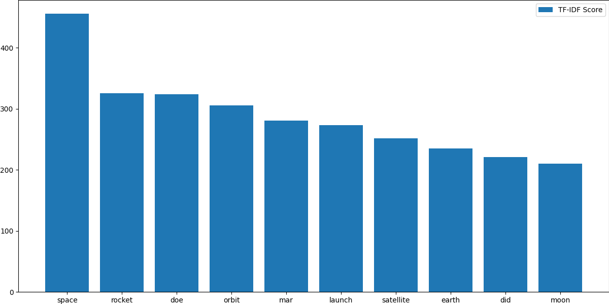

# space.stackexchange.com

# Overall Insights

<div align="center">

| Metric                             | Value |
|:-----------------------------------|------:|
| Total Posts                        | 16057 |
| Total Answers                      | 24118 |
| Number of Users                    | 31789 |
| Number of Comments                 | 28966 |
| Number of Votes                    | 370160|
| Number of Badges Awarded           | 74047|
| Number of Tags                     | 6837   |
| <hr/>                              | <3402 |
| Total Reputation Points            |4596658|
| Average Reputation per User        | 146.58 |
| <hr/>                              | <hr/> |
| Average Comment Score              | 1.06  |
| Average Comments per Post          | 4.14  |
| Average Comments per User          | 21.13 |
| Average Favorites per User         | 4.48  |
| Average Favorites per Post         | 1.99  |
| Average Upvote per Post            | 7.25  |
| Average Downvote per Post          | 0.39  |
| <hr/>                              | <hr/> |
| Total Closed Posts                 | 1159 |
| Total Open Posts                   | 14898 |
| Number of Posts with Related posts | 8238  |
| Average number of Related posts    | 1.89  |
| Number of Posts with Duplicates    | 714  |
| Number of Duplicate Posts          | 745  |

</div>

<div style="page-break-after: always;"></div>

# Posts

## Most Viewed Questions


## Most Answered Questions


<div style="page-break-after: always;"></div>

## Most Commented Questions


## Highest Scored Questions


<div style="page-break-after: always;"></div>

## Users With Most Questions Asked


## Users with Most Answers Written


## Graphs

**Warning**: Render times extremely high since the graphs are huge.

Post Graph: View it [here](http://stackexchange-miner.web.app/space.stackexchange.com/post_graph.html)

User Graph: View it [here](http://stackexchange-miner.web.app/space.stackexchange.com/user_graph.html)

<div style="page-break-after: always;"></div>

# PostLinks

## Posts with Most Related Posts


<div style="page-break-after: always;"></div>

## Posts with Most Duplicates


## Post Relation Graph

Please view it [here](http://stackexchange-miner.web.app/space.stackexchange.com/static_graph.html)

<div style="page-break-after: always;"></div>

# PostHistory

<div align="center">

| Event                                  |Number |
|----------------------------------------|------:|
| Edit Body                              | 45436 |
| Edit Title                             | 6058 |
| Edit Tags                              | 6053  |
| Post Closed                            | 1413  |
| Post Reopened                          | 254   |
| Rollback Tags                          | 30   |
| Community Owned                        | 89   |
| Post Migrated from Other SEs           | 291  |
| Post Merge Destination                 | 26   |
| Rollback Body                          | 222   |
| Post Merge Source                      | 10    |
| Post Locked                            | 24   |
| Post Deleted                           | 273   |
| Post Undeleted                         | 273   |
| Post Protected                         | 268   |
| Post Unprotected                       | 6   |
| Post Migrated to Other SEs             | 9    |
| Post Unlocked                          | 10    |
| Rollback Title                         | 57    |
| Marked as Highly Active                | 1508   |
| Unmarked as Highly Active              | 1    |

</div>


## Post Close Reason

<div align="center">

| Reason                                 |Number |
|----------------------------------------|------:|
| Duplicate                              | 601   |
| Not a question                         | 0   |
| Opinion-based                          | 157    |
| Localized                              | 0     |
| Subjective                             | 0     |
| Pointless                              | 0     |
| Unclear                                | 197   |
| General Reference                      | 0     |
| Off-topic                              | 249   |
| Too broad                              | 209   |

</div>


## Average Edits per Post

<div align="center">

| Type   | Value |
|--------|------:|
| Title  | 1.34 |
| Body   | 2.06  |
| Tags   | 1.21  |

</div>

## Average Rollbacks per Post

<div align="center">

| Type   | Value |
|--------|------:|
| Title  | 1.12  |
| Body   | 1.18  |
| Tags   | 1.03  |

</div>

<div style="page-break-after: always;"></div>

# Tags

## Tags Word Cloud

<div align="center">


</div>
<div style="page-break-after: always;"></div>

## Most Used Tags


<div style="page-break-after: always;"></div>

# Votes

## Total Votes


<!--  -->


<div align="center">

| Category      | Votes     |
|:---------------|----------:|
| Total         | 370160    |
| Accepted      | 8534     |
| Upvote        | 324669    |
| Downvote      | 17254     |
| Offensive     | 36        |
| Favorite      | 11494     |
| Close         | 0       |
| Reopen        | 0         |
| Bounty Start  | 793       |
| Bounty Close  | 789       |
| Delete        | 6203      |
| Undelete      | 313      |
| Spam          | 75       |

</div>

<div style="page-break-after: always;"></div>

## Special Types of Posts

<div align="center">


| Category     | Votes  |
|--------------|-------:|
| Spam         | 75    |
| Offensive    | 36     |
| Deleted      | 4650   |
| Undeleted    | 289    |
| Closed       | 0    |
| Reopened     | 0      |
| Favorited    | 5776   |
| Accepted     | 8534  |

</div>

<div style="page-break-after: always;"></div>

## Bounties

<div align="center">

| Category       | Value |
|----------------|------:|
| Opened         | 1204   |
| Closed         | 789   |
| Average Bounty | 118.42 |

</div>
<!-- <br/> -->

## Most Voted Questions

<div align="center">


</div>

<div style="page-break-after: always;"></div>

## Most Upvoted Questions

<div align="center">


</div>

<div style="page-break-after: always;"></div>

## Most Downvoted Questions

<div align="center">


</div>

<div style="page-break-after: always;"></div>

##  Most Favorited Questions

<div align="center">


</div>

<div style="page-break-after: always;"></div>

# Comments

## Comments by Year

<div align="center">


</div>

<div style="page-break-after: always;"></div>

## Comments by Month

<div align="center">


</div>

<div style="page-break-after: always;"></div>

## Most Commented Posts

<div align="center">


</div>

<div style="page-break-after: always;"></div>

## Users with Most Comments

<div align="center">


</div>

<div style="page-break-after: always;"></div>

# Users

## Most Reputed Users

<div align="center">


</div>

## Data Extracted from User Profiles __(profiles.results.json)__

| Location | Name | Personal Website | Media Handles | Photo |
|--|--|--|--|--|

Example:

```
"523901": {
    "name": "juandesant",
    "site": "http://www.skatelescope.org/",
    "location": "Jodrell Bank, United Kingdom",
    "links": [
        "http://iaa.csic.es/",
        "http://www.eso.org",
        "http://www.skatelescope.org",
        "https://www.skatelescope.org/sdp/",
        "https://www.skatelescope.org/tm/"
    ],
}
```
<div style="page-break-after: always;"></div>

# Badges

## Total Badges Awarded:

<div align="center">

| Category | Badges |
|----------|-------:|
| Total    | 74047 |
| Gold     | 683    |
| Silver   | 13402  |
| Bronze   | 59665  |

</div>

## Badge Word Clouds

### Gold Badges

<div align="center">


</div>

<div style="page-break-after: always;"></div>

### Silver Badges

<div align="center">


</div>

<div style="page-break-after: always;"></div>

### Bronze Badges


<div style="page-break-after: always;"></div>

## Top 10 Badges

<div align="center">

| Rank | Gold            | Silver        | Bronze           |
|------|-----------------|---------------|------------------|
| 1    | Famous Question | Yearling      | Autobiographer   |
| 2    | Fanatic         | Enlightened        | Supporter        |
| 3    | Electorate      | Notable Question      | Nice Answer         |
| 4    | Populist    | Good Answer  | Popular Question          |
| 5    | Great Answer        | Necromancer   | Student           |
| 6    | Socratic  | Good Question   | Nice Question  |
| 7    | Great Question      | Guru   | Editor         |
| 8    | Constable        | Enthusiast    | Teacher          |
| 9    | Publicist     | Constituent | Informed       |
| 10   | Copy Editor         | Civic Duty          |  Scholar  |

</div>

## Badges Awarded Only Once

```
Marshal
Reversal
Archaeologist
Lifeboat
```

<div style="page-break-after: always;"></div>

# Active Users Over Time

Net new users joining every month

<div align="center">


</div>

# Best Time to Ask a Question

Time of the day affecting questions and responses from the community:

<div align="center">

Hours in GMT


</div>

<div style="page-break-after: always;"></div>

# Voting vs. Reputation

Bar Graph of UpVote Rate vs Buckets of Reputation

<div align="center">


</div>

# Fastest Gun in the West

The first answers are almost always accepted.


<div style="page-break-after: always;"></div>

# MapReduce

## AboutMe of Users

<div align="center">


</div>

<!-- <div align="center"> -->


<!--  -->

<!-- </div> -->

<div style="page-break-after: always;"></div>

## Title of Posts

<div align="center">



</div>

<div align="center">


<!--  -->

</div>

<div style="page-break-after: always;"></div>

## Body of Posts

<div align="center">


</div>

<div style="page-break-after: always;"></div>

# Association Rule Mining

## Frequent Itemsets

### Tags

Shows last 10 itemsets. Entire list can be found at [ARM_badges_fits.csv](space.stackexchange.com/ARM_tags_fits.csv)

<div align="center">

|id|items|support|count|
|---|-------|---------|-------:|
|343|{low-energy-transfer,center-of-gravity}|0.0047|194|
|344|{center-of-gravity,trivia}|0.0026|109|
|345|{low-energy-transfer,trivia}|0.0041|170|
|346|{low-energy-transfer,schiaparelli-lander}|0.0011|44|
|347|{mariner,trivia}|0.0017|69|
|348|{mariner,schiaparelli-lander}|0.0013|55|
|349|{mir,flame,trivia}|0.002|84|
|350|{mir,planetary-defense,trivia}|0.0024|101|
|351|{mir,center-of-gravity,trivia}|0.0011|47|
|352|{mir,low-energy-transfer,trivia}|0.0016|66|


</div>

### Badges

<div align="center">

Shows last 10 itemsets. Entire list can be found at [ARM_badges_fits.csv](space.stackexchange.com/ARM_tags_fits.csv)

|id|items|support|count|
|---|-------|---------|-------:|
|21|{Editor}|0.0144|286|
|22|{Talkative}|0.0186|370|
|23|{Teacher}|0.023|457|
|24|{Booster}|0.0317|630|
|25|{Curious}|0.0462|919|
|26|{Caucus}|0.0504|1002|
|27|{Favorite Question}|0.0514|1022|
|28|{Announcer}|0.0573|1139|
|29|{Investor}|0.3005|5979|
|30|{Constable}|0.3132|6231|


</div>

<div style="page-break-after: always;"></div>

## Association Rules

### Tags

Shows last 10 rules. Entire list can be found at [ARM_tags_mined.csv](space.stackexchange.com/ARM_tags_mined.csv)

|id|LHS|RHS|support|confidence|coverage|lift|count|
|--|---|---|-------|----------|--------|----|----:|
|196|{mir,trivia}|{flame}|0.002|0.1822|0.0111|35.635|84|
|197|{mir,planetary-defense}|{trivia}|0.0024|0.9099|0.0027|29.2689|101|
|198|{planetary-defense,trivia}|{mir}|0.0024|0.6733|0.0036|46.7473|101|
|199|{mir,trivia}|{planetary-defense}|0.0024|0.2191|0.0111|27.0812|101|
|200|{mir,center-of-gravity}|{trivia}|0.0011|0.8103|0.0014|26.0662|47|
|201|{mir,trivia}|{center-of-gravity}|0.0011|0.102|0.0111|4.0954|47|
|202|{center-of-gravity,trivia}|{mir}|0.0011|0.4312|0.0026|29.9363|47|
|203|{mir,low-energy-transfer}|{trivia}|0.0016|0.6286|0.0025|20.2191|66|
|204|{mir,trivia}|{low-energy-transfer}|0.0016|0.1432|0.0111|5.5998|66|
|205|{low-energy-transfer,trivia}|{mir}|0.0016|0.3882|0.0041|26.9539|66|

### Badges

Shows last 9 rules. Entire list can be found at [ARM_badges_mined.csv](space.stackexchange.com/ARM_badges_mined.csv)

|id|LHS|RHS|support|confidence|coverage|lift|count|
|--|---|---|-------|----------|--------|----|----:|
|2|{}|{Editor}|0.0144|0.0144|1.0|1.0|286|
|3|{}|{Talkative}|0.0186|0.0186|1.0|1.0|370|
|4|{}|{Teacher}|0.023|0.023|1.0|1.0|457|
|5|{}|{Booster}|0.0317|0.0317|1.0|1.0|630|
|6|{}|{Curious}|0.0462|0.0462|1.0|1.0|919|
|7|{}|{Caucus}|0.0504|0.0504|1.0|1.0|1002|
|8|{}|{Favorite Question}|0.0514|0.0514|1.0|1.0|1022|
|9|{}|{Announcer}|0.0573|0.0573|1.0|1.0|1139|
|10|{}|{Investor}|0.3005|0.3005|1.0|1.0|5979|
|11|{}|{Constable}|0.3132|0.3132|1.0|1.0|6231|
